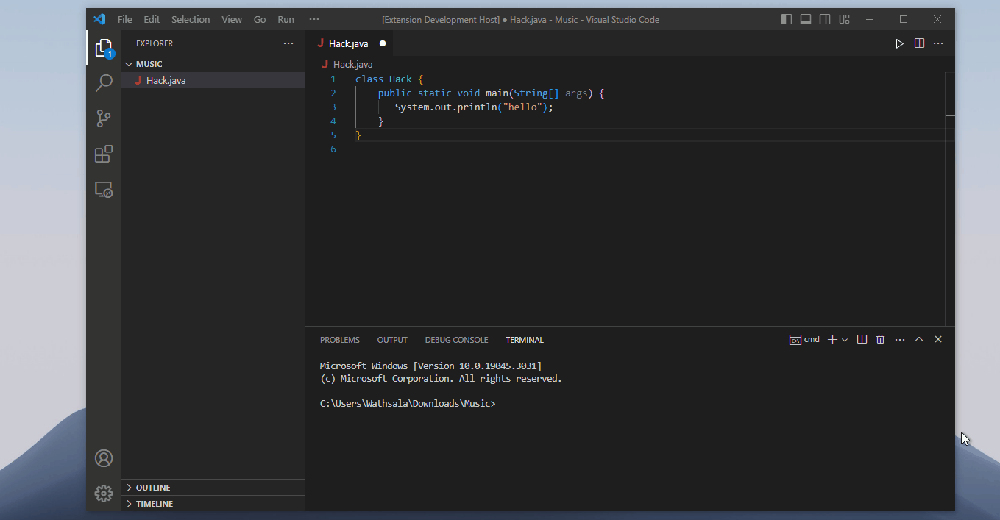

# Java-Extension

Java-Extension is a VS Code extension that simplifies Java programming. It provides code snippets, compiler integration, and an enhanced development experience.

## Prerequisites

Before using this extension, you need to install the Java compiler. You can download the Java Development Kit (JDK) from the official Oracle website: [Java SE Downloads](https://www.oracle.com/java/technologies/javase-jdk14-downloads.html)

## Installation

1. Launch Visual Studio Code.
2. Go to the Extensions view (Ctrl+Shift+X).
3. Search for "Java-Extension".
4. Click on the "Install" button.

## Usage

1. Open a Java file in Visual Studio Code.
2. Use the provided code snippets to insert common Java patterns.
3. Click the "Run" button or use the `java-extension.brj` command to compile and run your Java code.

## Snippets

The extension provides the following code snippets:

- `!jmain`: Java template for a class with a `main` method.
- `!jif`: Java template for an `if-else if-else` statement.
- `!jswitch`: Java template for a `switch` statement.
- `!jwhile`: Java template for a `while` loop.
- `!jdowhile`: Java template for a `do-while` loop.
- `!jfor`: Java template for a `for` loop.
- `!jmethod`: Java template for a method.
- `!jinterface`: Java template for an interface.
- `!jclass`: Java template for a class.

## Current Contributors 

<table>
  <tr>
    <td align="center">
        
         <a href="https://github.com/NithmaFdo"><b>Nithma Fernando</b> </a>
        
Contributed the icon of Java-Extension.

    </td>
  </tr>
</table>

## Contributing

Contributions are welcome! If you encounter any issues or have suggestions for improvement, please report them in the [issue tracker](https://github.com/adhishtanaka/Java-Extension/issues).

## License

This extension is licensed under the [MIT License](LICENSE).
